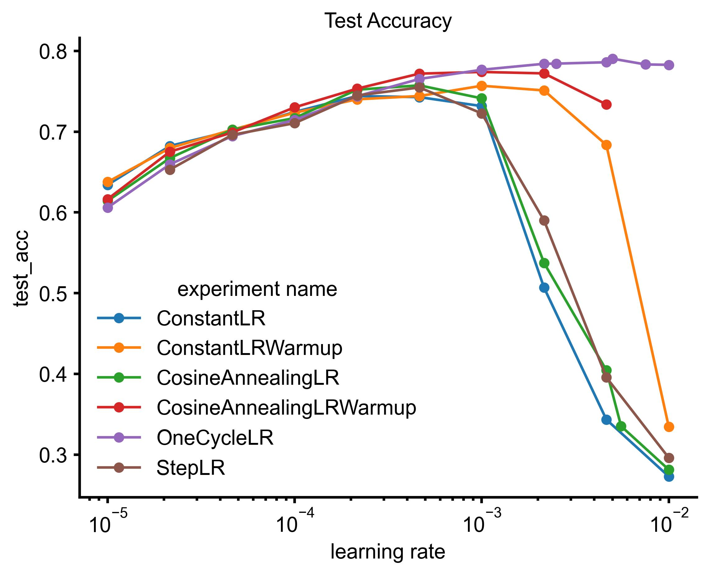

# Deep Learning Research Kitchen


This repository houses the materials for the talk on learning rate schedulers in deep learning within the seminar [Deep Learning Research Kitchen](https://uni-tuebingen.de/fakultaeten/mathematisch-naturwissenschaftliche-fakultaet/fachbereiche/informatik/lehrstuehle/methoden-des-maschinellen-lernens/lehre/).  
The focus of the research is on exploring the impact of different learning rate schedulers' maximum learning rates on the performance of a small vision transformer model for image classification on the CIFAR-10 dataset.

Besides the experimental results this repository also contains the [slides](./slides/build/slides.pdf) used in the presentation.

## Research Question

The primary question addressed by the experiments conducted here is:  
**"How do the maximum learning rates of various learning rate schedulers (constant, cosine annealing, step LR, 1cycleLR, etc.) affect the performance of a small vision transformer model for image classification on CIFAR-10?"**

## Repository Structure:

```bash
.
├── LICENSE
├── project
│   ├── data                        # data for experiments
│   ├── experiments                 # source code for experiments
│   ├── figs                        # figures generated by notebooks
│   ├── results                     # containing experimental results
│   └── ViT-CIFAR                   # repository with scaled down vision transformer as reference
│   ├── experiment_analysis.ipynb   # notebook for experiment analysis
│   ├── lr_playground.ipynb         # trying out new schedule curves and different configurations
│   ├── run_experiments.ipynb       # start experiments
│   ├── poetry.lock                 # dependencies are organized with poetry
│   ├── pyproject.toml
│   ├── standard_plots.ipynb        # notebook for standard plots in the presentation
├── README.md
├── readme_figs                     # directory containing figures for README.md
└── slides                          # tex code for the slides
    ├── bibliography.bib
    ├── build                       # containing the finished presentation
    ├── graphics                    # screenshots from paper
    ├── latexmkrc
    ├── slides.tex
    └── theme
```

## Experiments

For the experiments I chose a supervised image classification task on [CIFAR10](https://www.cs.toronto.edu/~kriz/cifar.html) with a [scaled down vision transformer architecture](https://github.com/omihub777/ViT-CIFAR).

### Dataset and Model:

**Dataset**:
The specific CIFAR10 dataset version was provided by [torchvision](https://pytorch.org/vision/main/generated/torchvision.datasets.CIFAR10.html):

```Python
train_dataset = CIFAR10(
    root=DATASET_PATH,
    train=True,
    transform=self.train_transform,
    download=True,
)
val_dataset = CIFAR10(
    root=DATASET_PATH,
    train=True,
    transform=self.test_transform,
    download=True,
)
```

For more details please refer to [pl_data_module.py](./project/experiments/dataset/pl_data_module.py).

**Architecture**:  
The vision transformer architecture used in [ViT-CIFAR](https://github.com/omihub777/ViT-CIFAR) is a scaled down version (12.5M to 6.3M parameters) of the original implementation as in [An Image is Worth 16x16 Words: Transformers for Image Recognition at Scale](https://arxiv.org/abs/2010.11929) (86M, 307M or 632M parameters).

**Learning Rate Schedulers**:

Learning rate schedules used for the experiments:

- [ConstantLR](https://pytorch.org/docs/stable/generated/torch.optim.lr_scheduler.ConstantLR.html)
- [ConstantLR](https://pytorch.org/docs/stable/generated/torch.optim.lr_scheduler.ConstantLR.html) with warmup (use [SequentialLR](https://pytorch.org/docs/stable/generated/torch.optim.lr_scheduler.SequentialLR.html) with [LinearLR](https://pytorch.org/docs/stable/generated/torch.optim.lr_scheduler.LinearLR.html))
- [CosineAnnealingLR](https://pytorch.org/docs/stable/generated/torch.optim.lr_scheduler.CosineAnnealingLR.html)
- [CosineAnnealingLR](https://pytorch.org/docs/stable/generated/torch.optim.lr_scheduler.CosineAnnealingLR.html) with warmup (use [SequentialLR](https://pytorch.org/docs/stable/generated/torch.optim.lr_scheduler.SequentialLR.html) with [LinearLR](https://pytorch.org/docs/stable/generated/torch.optim.lr_scheduler.LinearLR.html))
- [StepLR](https://pytorch.org/docs/stable/generated/torch.optim.lr_scheduler.StepLR.html)
- [OneCycleLR](https://pytorch.org/docs/stable/generated/torch.optim.lr_scheduler.OneCycleLR.html)
- [CosineAnnealingWarmRestarts](https://pytorch.org/docs/stable/generated/torch.optim.lr_scheduler.CosineAnnealingWarmRestarts.html)

### Experiment Setup:

For training we used:

- Batch size: 512 (train), 1024 (val, test)
- Optimizer: [AdamW](https://pytorch.org/docs/stable/generated/torch.optim.AdamW.html) with:
  - weight decay: $10^4$
  - betas: (0.9, 0.999)
  - eps: 1e-08
- epochs: 100
- Metrics:
  - Cross-Entropy
  - Accuracy

For testing I used the best model with respect to the validation accuracy.

**Parameter Search space**:

| Scheduler                   | Parameter                                     | Search Space                    |
| --------------------------- | --------------------------------------------- | ------------------------------- |
| ConstantLR (warmup)         | factor = 1, \*                                | lr $\in [10^{-6}, 10^{-2}]$     |
| CosineAnnealingLR (warmup)  | $T_{\max} = 100$, $\eta_{\min} = 10^{-6}$, \* | lr $\in [10^{-5}, 10^{-2}]$     |
| StepLR                      | step size = 5, $\gamma = 0.9$                 | lr $\in [10^{-5}, 10^{-2}]$     |
| OneCycleLR                  | total steps = 100                             | max-lr $\in [10^{-5}, 10^{-2}]$ |
| CosineAnnealingWarmRestarts | lr $ \approx 4.6 \cdot 10^{-4}$               | $T_0 \in [10, 50]$              |

\*: for the warmup version I choose 6 warmup epochs

### Results:


The goal of the experiments was to gather insights into how different learning rate schedulers and different schedule configurations influence training. Especially we will focus on the maximal learning rate a scheduler will return.

<p align="center">
    
</p>

We can see that all schedulers perform somewhere equal between $10^{-5}$ and  $< 10^{-3}$. They all increase their performance. But at around $10^{-3}$ we can see a clear distinction between 3 groups: classical decaying schedules (ConstantLR, CosineAnnealingLR, and StepLR), schedules with a warmup (ConstantLR, CosineAnnealingLR both with 6 warmup epochs), and the OneCycleLR.  
For the following results please note that I try to correlate the increasing or decreasing performance with the maximal learning rate, but there is no exact proof that is also the case.  
The first group starts to under-fit earliest followed by the with warmup extended schedules. Here we can see two things. The first warmup seems to stabilize training for higher learning rates as expected and it also improves performance (ever so slightly). In the third group, we just have the OneCycleLR. As described in the literature on OneCycleLR combines warmup, a high learning rate, and a plateau thus making it more robust for high learning rates and potentially better concerning the achieved validation and test accuracy. These assumptions are backed up by the conducted experiments where the runs done with OneCycle are the best-performing ones. 


> **Takeaway**
>  
> For experiments with a fixed number of epochs, it could be beneficial to use a warmup with a cosine annealing. For experiments where this is not so clear (e.g. RL), you could use warmup with a constant learning rate in the end.

Please Note that my experiments have also a couple of weaknesses:

Setup

- Dataset size. Other datasets might reveal a higher variance in training behavior
- Model Complexity: The simplified ViT could be not as sensitive as large scale models

Training

- Limited exploration space
- Tuning only for scheduler hyperparameter, leaving other parameters constant
- Training duration
- Used metrics could be expanded also F1 score, … 
- No statistical significance conducted. 


### Code:

This repository is mainly based on [pytorch](https://pytorch.org/) and [pytorch lightning](https://lightning.ai/docs/pytorch/stable/). To install the dependencies please change into [project/](./project/) and execute: 
```bash
poetry install --no-root
```

After successfull installation you can proceed with your own experiments or further analysis. For those two tasks the code  is separated into:

1. **An experiments backend**: Here we have all the implemented parts used for the experiments. This mainly relies on: [model/pl_module.py](./project/experiments/model/pl_module.py), [dataset/pl_data_module.py](./project/experiments/dataset/pl_data_module.py) and [trainer/train.py](./project/experiments/trainer/train.py). The `train` function from [trainer/train.py](./project/experiments/trainer/train.py) can be called in JupyterNotebooks as in the main [training notebook](./project/run_experiments.ipynb):

    ```Python
    from experiments.trainer.train import train_model
    from experiments.model.vit import ViT

    model_args = {
        "model_cls": ViT,
        "model_hparams": {},
        "optimizer_name": "AdamW",
        "optimizer_hparams": {"lr": 10-5, "weight_decay": 1e-4},
        "lr_scheduler_name": "CosineAnnealingLR",
        "lr_scheduler_hparams": {"T_max":100, "eta_min":1e-6},
    }

    train_model(model_kwargs=config, max_epochs=100, save_name="CosineAnnealingLR")
    ```

    From my side I used an NVIDIA3060 with 12GB of VRAM and 16GB of RAM. Each run endured approximately one hour.  

2. **Analysis Notebook(s)**: The analysis of the results stored [results/](./project/results/) is happening in a main note_book [experiment_analysis.ipynb](./project/experiment_analysis.ipynb). To successfully run the experiments please make sure you extract the uploaded `results.zip` in [results/](./project/results/) so you get following directory structure: 
    ```bash 
    results/
    └── saved_models
        ├── ConstantLR
        ├── ConstantLRWarmup
        ├── CosineAnnealingLR
        ├── CosineAnnealingLRWarmup
        ├── CosineAnnealingWarmRestarts
        ├── OneCycleLR
        └── StepLR
    ```

    Each folder contains `lightning_logs` with different `version_*`. Each version contains at least one `hparams.yaml` and every second a `metrics.csv`.  
    The generated plots will be stored in [figs/](./project/figs/)

## Contribution

This repository serves as a foundation for exploring vision transformers on CIFAR-10. We encourage users to contribute their own experiments and extend this work further.

If you've been experimenting with different learning rate schedulers or other hyperparameter configurations, we welcome you to submit a pull request with your code modifications. Additionally, sharing your training performance data is highly valuable. This data should include, at minimum:

- Train Loss: The average loss per epoch during training.
- Train Accuracy: The model's accuracy on the training set after each epoch.
- Validation Accuracy: The model's accuracy on the validation set after each epoch.

By incorporating these metrics, we can collectively build a more comprehensive understanding of how different configurations impact model performance.

Feel free to open an issue or discussion thread to share your findings. 

## License

The repository is licensed under the [MIT license](./LICENSE). 

## Acknowledgements

This repo was created within the Deep-Learning-Research-Kitchen-Seminar hosted by Dr. Antonio Orvieto, Dr. Jonas Geiping, Dr. Frank Schneider and Prof. Dr. Philipp Hennig. Thank you for your valuable insights and the framework to build this project. 

Further I especially would like to thank Prof. Hennig for sharing his personal template for the slides.  